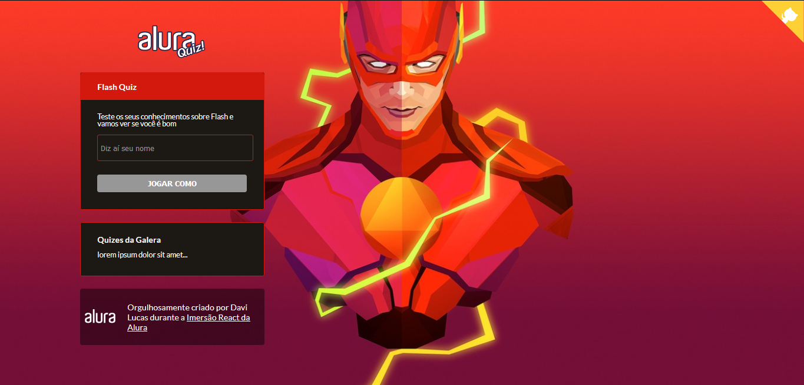

<h1 align="center">
  <a href="https://flash-quiz-next.davidlpc1.vercel.app/">Flash Quiz com NextJS</a>
</h1>
<h2 align="center">🚀 Feito na imersão React NextJS da Alura 🚀</h2>



Content
=================
   * [About](#About)
   * [Technologies](#Technologies)
   * [Downloading](#Downloading)
   * [StartingTheApplication](#Starting)
  
<h3 align="center"> 
	🚧 Building... 🚧
</h3>
 
<div id="About">    

## About
### This is @ davidlpc1's  project for React NextJS Imersion(Alura)
### The project is an quiz about Flash

</div>

<div id="Downloading">

## Downloading

<strong><a href="https://github.com/davidlpc1/flash-quiz-next/archive/main.zip">Download ZIP</a></strong>
<strong>OR</strong>

```
git clone https://github.com/davidlpc1/flash-quiz-next
```

</div>

<div id="Technologies">

## Technologies

<code></code>
<code></code>
<code></code>
<code></code>

</div>

<div id="Starting">

## Starting
``` 
  npm install
  npm run dev
```
OR
``` 
  yarn 
  yarn dev
```
</div>

### Features

- [x] Homepage
- [x] Quiz Page
- [x] Endpoint of db.json
- [x] Components
- [x] Eslint

### Autor
---

<a href="https://github.com/davidlpc1">
 
 <br />
 <sub><b>Davi Lucas</b></sub></a> <a href="https://app.rocketseat.com.br/me/davi-lucas-marques-de-freitas-04149">🚀</a>


Made with ❤️ by Davi Lucas 👋🏽 Contact me!

[](https://twitter.com/ProgramadorDavi) [](https://www.linkedin.com/in/davi-lucas-93abb71b3/) 
[](mailto:davilucasdlcreator@gmail.com)